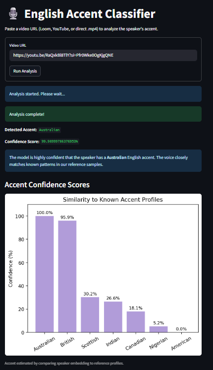

# English Accent Classifier

## What Is This?

This is a simple tool that helps evaluate spoken English for hiring purposes. It takes a public video URL (like a Loom or YouTube link), extracts the audio, and analyzes the speaker's accent. It tells you what kind of English accent the speaker has (e.g., British, American, Australian) and how confident it is in that guess.

## Features

- **Video Input:** Accepts public video URLs (Loom, YouTube, or direct MP4 links).
- **Audio Extraction:** Converts video to audio using ffmpeg.
- **Language Check:** Uses OpenAI Whisper to check if the audio is in English.
- **Accent Classification:** Compares the speaker's voice to a set of reference accents (British, American, Australian, etc.) using SpeechBrain embeddings.
- **Confidence Scoring:** Provides a confidence score (0–100%) for the detected accent.
- **User-Friendly UI:** Built with Streamlit for easy testing and deployment.

## Getting Started

### Prerequisites

- Python 3.8 or higher
- FFmpeg installed on your system
  - Download from [ffmpeg.org](https://ffmpeg.org/download.html)
  - Make sure it's added to your system PATH

### Installation

1. Clone this repository:
   ```bash
   git clone <repository-url>
   cd <repository-directory>
   ```

2. Install the required packages:
   ```bash
   pip install -r requirements.txt
   ```

3. Run the Streamlit app:
   ```bash
   streamlit run app.py
   ```

## Usage

1. Open the app in your browser (usually at http://localhost:8501).
2. Paste a video URL into the input field.
3. Click "Run Analysis."
4. View the results:
   - Detected accent
   - Confidence score
   - Short explanation
   - Bar chart of accent confidence scores

## Dataset

The tool uses a set of reference audio clips for different English accents (British, American, Australian, etc.). These are stored in the `reference_accents/` directory. Each accent has a few sample WAV files (16kHz mono) that are used to generate reference embeddings.

## Screenshots

Here's what the app looks like in action:



*The app shows the detected accent, confidence score, and a bar chart of accent confidence scores.*

---

Feel free to reach out if you have any questions or need help! 